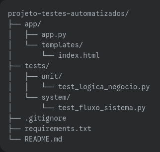

## Projeto de Testes Automatizados - Gerenciador de Tarefas Simples

Este projeto demonstra o desenvolvimento de testes automatizados (unitários e de sistema) para uma aplicação web simples de gerenciamento de tarefas. A aplicação foi construída com **Flask (Python)** e os testes utilizam o módulo **`unittest`** para testes unitários e **Selenium WebDriver** para testes de sistema.

### Visão Geral do Projeto

O objetivo deste projeto é criar uma aplicação web básica onde os usuários podem:

* **Adicionar** novas tarefas.
* **Marcar** tarefas como concluídas ou desmarcá-las.
* **Excluir** tarefas.

Em seguida, desenvolvemos testes automatizados para garantir que essas funcionalidades operem conforme o esperado, cobrindo tanto a lógica interna da aplicação (testes unitários) quanto a interação do usuário com a interface (testes de sistema).

### Estrutura do Projeto


### Como Configurar e Rodar o Projeto

Siga os passos abaixo para configurar seu ambiente de desenvolvimento e executar a aplicação, bem como os testes.

### 1. Pré-requisitos

Certifique-se de ter o seguinte software instalado em sua máquina:

* **Python 3.x**: Baixe e instale a versão mais recente em [python.org](https://www.python.org/downloads/).
* **Driver do Navegador**: Para os testes de sistema com Selenium, você precisará do WebDriver correspondente ao navegador que deseja usar (recomendamos Chrome para simplicidade).
    * **Google Chrome**: Baixe o `chromedriver` da [página oficial do ChromeDriver](https://chromedriver.chromium.org/downloads/). **É crucial que a versão do driver seja compatível com a versão do seu navegador Chrome.**
    * **Mozilla Firefox**: Baixe o `geckodriver` da [página oficial do GeckoDriver](https://github.com/mozilla/geckodriver/releases).
    * **Microsoft Edge**: Baixe o `msedgedriver` da [página oficial do Edge WebDriver](https://developer.microsoft.com/en-us/microsoft-edge/tools/webdriver/).

    **Após baixar o driver**, coloque o arquivo executável (ex: `chromedriver.exe` no Windows, `chromedriver` no Linux/macOS) na **raiz da pasta do seu projeto** (`projeto-testes-automatizados/`) ou adicione o diretório onde ele está ao seu **PATH do sistema**.

### 2. Instalação das Dependências

1.  **Clone este repositório** (se estiver usando Git) ou baixe o arquivo ZIP e extraia-o:
    ```bash
    git clone [https://github.com/seu-usuario/projeto-testes-automatizados.git](https://github.com/seu-usuario/projeto-testes-automatizados.git)
    cd projeto-testes-automatizados
    ```
    *(**Ajuste** `seu-usuario/projeto-testes-automatizados.git` para o link real do seu repositório no GitHub)*

2.  **Navegue até a pasta raiz do projeto:**
    ```bash
    cd projeto-testes-automatizados
    ```

3.  **Instale as dependências Python** listadas no `requirements.txt`:
    ```bash
    pip install -r requirements.txt
    ```

### 3. Rodar a Aplicação Web (Flask)

Para que os testes de sistema possam interagir com a interface, a aplicação Flask precisa estar em execução.

1.  Em um terminal, navegue até a pasta `app/`:
    ```bash
    cd app
    ```
2.  Execute a aplicação Flask:
    ```bash
    python app.py
    ```
    Você verá uma mensagem indicando que o servidor está rodando, geralmente em `http://127.0.0.1:5000/`. **Mantenha este terminal aberto** enquanto executa os testes de sistema.

### 4. Rodar os Testes Unitários

Estes testes verificam a lógica de negócio interna da aplicação, sem a necessidade da interface gráfica ou de um navegador.

1.  Em um **novo terminal**, navegue de volta à pasta raiz do projeto (`projeto-testes-automatizados/`).
2.  Navegue até a pasta dos testes unitários:
    ```bash
    cd tests/unit
    ```
3.  Execute os testes:
    ```bash
    python test_logica_negocio.py
    ```
    O resultado dos testes será exibido no terminal, indicando se passaram ou falharam.

### 5. Rodar os Testes de Sistema (Funcionais)

Estes testes simulam a interação de um usuário real com a aplicação através de um navegador web.

**Importante:** Certifique-se de que a **aplicação Flask (`app.py`) esteja rodando** (conforme o passo 3) antes de executar estes testes.

1.  No terminal, navegue de volta à pasta raiz do projeto (`projeto-testes-automatizados/`).
2.  Navegue até a pasta dos testes de sistema:
    ```bash
    cd tests/system
    ```
3.  Execute os testes:
    ```bash
    python test_fluxo_sistema.py
    ```
    Um navegador web (Chrome, Firefox, etc., dependendo do driver configurado) será aberto automaticamente e você verá as ações automatizadas sendo executadas. Ao final, o navegador será fechado e o resultado dos testes será exibido no terminal.

---

## Cenários de Teste Implementados

### Testes Unitários (`tests/unit/test_logica_negocio.py`)

* **Validação de Tarefa:**
    * Verifica se a função rejeita tarefas vazias ou que contêm apenas espaços.
    * Testa se a função rejeita tarefas que excedem o limite de caracteres.
    * Confirma se tarefas válidas são aceitas corretamente.
* **Manipulação de Tarefa (Simulação):**
    * Valida a funcionalidade de marcar e desmarcar tarefas existentes.
    * Assegura que a tentativa de manipular uma tarefa com um ID inexistente não causa erros e não altera o estado de outras tarefas.

### Testes de Sistema (`tests/system/test_fluxo_sistema.py`)

* **Adicionar e Verificar Tarefa:** Simula a entrada de uma nova tarefa através da interface do usuário e verifica se ela é exibida corretamente na lista de tarefas.
* **Marcar e Desmarcar Tarefa:** Simula a ação de marcar uma tarefa como concluída e, em seguida, desmarcá-la, verificando as alterações visuais (como o estilo de texto "riscado").
* **Excluir Tarefa:** Simula a exclusão de uma tarefa e confirma se ela é removida com sucesso da lista na interface.
